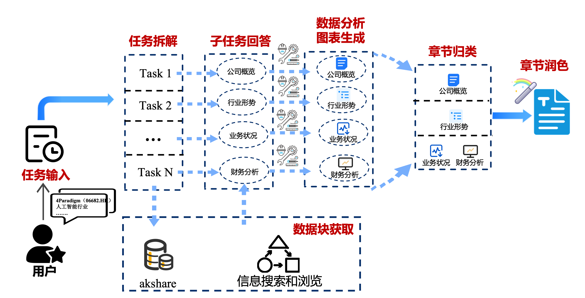

# AFAC_agent_AIDM
Implementation of my agent used in 2025 AFAC TianChi competition: https://tianchi.aliyun.com/competition/entrance/532354

------

pip install numpy pandas matplotlib langchain_openai langchain_community langchain_core requests akshare chineseize-matplotlib

------
Full explanation of Version_0 can refer to Zhihu:
1. Data collection: https://zhuanlan.zhihu.com/p/1932786778286297319
2. Agent design: https://zhuanlan.zhihu.com/p/1932787728283592116

------
20250928 V1 version include:
1. search engine (baidu / arxiv)
2. data analyse tool via running python code in E2B
3. tools for adding charts via generating html raw code
4. charts quality checking with VLMs
